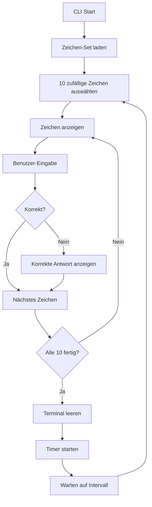

# Nihon CLI - Entwicklungskonzept

## Projektübersicht
Ein Python-basiertes CLI-Tool zum Erlernen japanischer Schriftzeichen (Hiragana und Katakana) mit automatisierten Lernintervallen.

## Architektur-Überblick

### Technische Grundlagen
- **Sprache**: Python 3.8+
- **Architektur**: Class-based Design mit Python Best Practices
- **Abhängigkeiten**: Nur Standard-Python-Bibliotheken
- **Design-Prinzip**: Domain-Driven Design mit einfacher, erweiterbarer Struktur

### Kern-Komponenten
```
nihon-cli/
├── src/
│   ├── nihon_cli/
│   │   ├── __init__.py
│   │   ├── main.py              # CLI Entry Point
│   │   ├── core/
│   │   │   ├── __init__.py
│   │   │   ├── character.py     # Character Domain Model
│   │   │   ├── quiz.py          # Quiz Logic
│   │   │   └── timer.py         # Learning Timer
│   │   ├── data/
│   │   │   ├── __init__.py
│   │   │   ├── hiragana.py      # Hiragana Zeichen-Daten
│   │   │   └── katakana.py      # Katakana Zeichen-Daten
│   │   └── cli/
│   │       ├── __init__.py
│   │       └── commands.py      # CLI Command Handler
├── tests/
├── setup.py
└── README.md
```

## Entwicklungsphasen

### Phase 1: Projekt-Setup und Grundstruktur
**Ziel**: Entwicklungsumgebung und Projektstruktur etablieren

#### Schritt 1.1: Projekt-Initialisierung
- Python-Projekt mit setup.py erstellen
- Verzeichnisstruktur anlegen
- Git-Repository initialisieren
- Virtual Environment einrichten

#### Schritt 1.2: Basis-Konfiguration
- `__init__.py` Dateien erstellen
- Setup.py für CLI-Installation konfigurieren
- Grundlegende Imports und Exports definieren

### Phase 2: Domain Models und Datenstrukturen
**Ziel**: Kern-Datenmodelle implementieren

#### Schritt 2.1: Character Domain Model
- `Character` Klasse mit Attributen:
  - `symbol`: Das japanische Zeichen
  - `romaji`: Lateinische Umschrift
  - `character_type`: 'hiragana' oder 'katakana'

#### Schritt 2.2: Zeichen-Datenbanken
- Hiragana-Zeichen in `data/hiragana.py` definieren
- Katakana-Zeichen in `data/katakana.py` definieren
- Vollständige Zeichensätze mit Romaji-Umschrift

### Phase 3: Kern-Logik Implementation
**Ziel**: Quiz- und Timer-Funktionalität entwickeln

#### Schritt 3.1: Quiz-Engine
- `Quiz` Klasse implementieren:
  - Zufällige Zeichenauswahl (10 pro Runde)
  - Eingabe-Validierung
  - Einfaches Feedback-System (Richtig/Falsch mit korrekter Antwort)
  - Ergebnis-Tracking

#### Schritt 3.2: Timer-System
- `LearningTimer` Klasse implementieren:
  - 25-Minuten Standard-Intervalle
  - 5-Sekunden Test-Modus
  - Terminal-Clearing zwischen Sessions
  - Kontinuierlicher Betrieb bis manueller Stop

### Phase 4: CLI-Interface
**Ziel**: Benutzerfreundliche Kommandozeilen-Schnittstelle

#### Schritt 4.1: Argument-Parsing
- Argparse-Setup für Kommandos:
  - `nihon cli hiragana [--test]`
  - `nihon cli katakana [--test]`
  - `nihon cli hiraganakatakana [--test]`
  - `nihon cli --help`

#### Schritt 4.2: Command Handler
- CLI-Kommando-Routing implementieren
- Fehlerbehandlung für ungültige Eingaben
- Hilfe-System und Usage-Informationen

### Phase 5: Integration und Main Entry Point
**Ziel**: Alle Komponenten zusammenführen

#### Schritt 5.1: Main Application
- `NihonCli` Hauptklasse implementieren
- Komponenten-Integration (Quiz, Timer, CLI)
- Session-Management und Cleanup

#### Schritt 5.2: Entry Point Setup
- `main.py` als CLI-Entry-Point konfigurieren
- Setup.py für `nihon` Kommando-Installation
- Fehlerbehandlung auf Anwendungsebene

### Phase 6: Testing und Verfeinerung
**Ziel**: Funktionalität validieren und optimieren

#### Schritt 6.1: Manuelle Tests
- Alle CLI-Kommandos testen
- Timer-Funktionalität validieren
- Quiz-Logik und Feedback prüfen
- Edge-Cases identifizieren

#### Schritt 6.2: Code-Qualität
- Code-Review und Refactoring
- Docstrings und Kommentare hinzufügen
- PEP 8 Compliance sicherstellen
- Performance-Optimierungen

## Implementierungsdetails

### Lernzyklus-Flow


### Datenstruktur-Beispiel
```python
# Beispiel für Hiragana-Zeichen
HIRAGANA_CHARACTERS = [
    Character(
        symbol="あ",
        romaji="a",
        character_type="hiragana"
    ),
    Character(
        symbol="か",
        romaji="ka",
        character_type="hiragana"
    ),
    # ... weitere Zeichen
]
```

### CLI-Kommando-Struktur
```python
# Beispiel für CLI-Kommando-Handling
def handle_hiragana_command(test_mode=False):
    timer_interval = 5 if test_mode else 1500  # 5 sec vs 25 min
    quiz = Quiz(character_set="hiragana")
    timer = LearningTimer(interval=timer_interval)
    
    while True:
        quiz.run_session()
        timer.wait_for_next_session()
```

## Qualitätssicherung

### Code-Standards
- **PEP 8**: Python Style Guide befolgen
- **Type Hints**: Für bessere Code-Klarheit
- **Docstrings**: Alle Klassen und Methoden dokumentieren
- **Error Handling**: Graceful Exception-Behandlung

### Testing-Strategie
- **Manuelle Tests**: Alle CLI-Kommandos durchgehen
- **Edge Cases**: Ungültige Eingaben, Unterbrechungen
- **Performance**: Timer-Genauigkeit und Speicher-Verbrauch
- **Usability**: Benutzerfreundlichkeit des Interfaces

## Erweiterbarkeit

### Vorbereitung für Phase 2
- **Modulare Struktur**: Einfache Erweiterung um neue Zeichensätze
- **Konfigurierbare Timer**: Basis für anpassbare Intervalle
- **Statistik-Hooks**: Vorbereitung für Fortschrittsverfolgung
- **Plugin-Architecture**: Grundlage für Grammatik-Modi

### Technische Schulden vermeiden
- **Clean Code**: Lesbare, wartbare Implementierung
- **Single Responsibility**: Jede Klasse hat einen klaren Zweck
- **Dependency Injection**: Testbare, flexible Komponenten
- **Configuration Management**: Zentrale Konfiguration

## Zeitschätzung

| Phase | Beschreibung | Geschätzte Zeit |
|-------|--------------|-----------------|
| 1 | Projekt-Setup | 2-3 Stunden |
| 2 | Domain Models | 3-4 Stunden |
| 3 | Kern-Logik | 6-8 Stunden |
| 4 | CLI-Interface | 4-5 Stunden |
| 5 | Integration | 3-4 Stunden |
| 6 | Testing & Verfeinerung | 4-6 Stunden |
| **Total** | **MVP-Entwicklung** | **22-30 Stunden** |

## Erfolgskriterien

### MVP-Ziele
- ✅ Funktionsfähiges CLI-Tool
- ✅ Hiragana/Katakana Training implementiert
- ✅ Timer-System funktional
- ✅ Alle CLI-Kommandos verfügbar
- ✅ Installierbar via setup.py

### Qualitätsziele
- ✅ PEP 8 konform
- ✅ Vollständig dokumentiert
- ✅ Manuell getestet
- ✅ Erweiterbar für Phase 2
- ✅ Benutzerfreundlich

## Nächste Schritte

Nach Fertigstellung des MVP:
1. **User Feedback** sammeln
2. **Performance-Metriken** erheben
3. **Phase 2 Planung** basierend auf Erfahrungen
4. **Automatisierte Tests** implementieren
5. **CI/CD Pipeline** einrichten

---

*Dieses Entwicklungskonzept dient als Roadmap für die strukturierte Umsetzung des Nihon CLI-Tools. Jede Phase baut auf der vorherigen auf und kann iterativ entwickelt und getestet werden.*